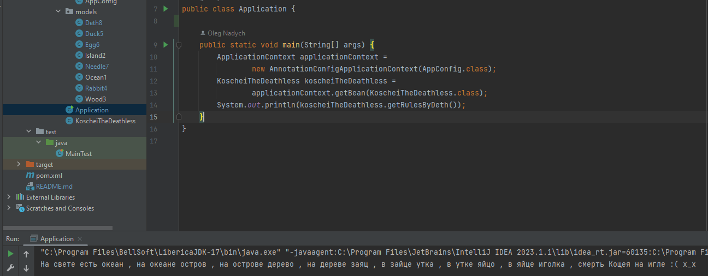
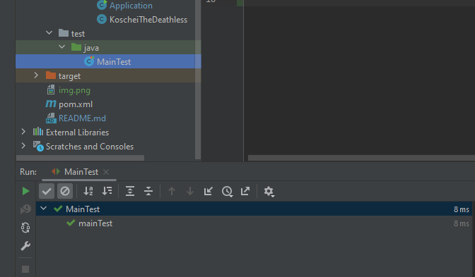

«На море на океане есть остров, на том острове дуб стоит, под дубом сундук зарыт, в сундуке — заяц, в зайце — утка, в утке — яйцо, в яйце — игла, — смерть Кощея»
Зависимости остались прежние. В упражнении появился компонент Кощей Бессмертный (KoscheiTheDeathless), который расскажет, где находится его смерть, если вызвать метод getRulesByDeth().
Для описания поиска смерти использованы классы в пакете models. Для вашего удобства они были пронумерованы: Ocean1, Island2, Wood3 и так далее.
Чтобы Спринг видел все бины, в классе AppConfig была добавлена аннотация @ComponentScan.
В Спринге связать бины можно различными способами, рассмотрим их на примере:

KoscheiTheDeathless связывается с Ocean1 через сеттер setOcean и аннотации @Autowired над ней.

Ocean1 связан с Island2 через поле и аннотацию, которая подтянет бин Island2 через метод getIsland() в классе AppConfig. Обратите внимание, что данный метод обозначен аннотацией @Bean, что автоматически подтягивает аргументы в метод. В качестве аргумента выступает бин Wood3.

Бин Wood3 помечен как компонент, который конструируется через связывание по @Autowired с помощью конструктора.

Задание:
Собрать цепочку до 8го элемента, использовав все вышеперечисленные методы связывания. После выполнения вы должны получить полную фразу. Проверьте своё решение тестом из заготовки.

